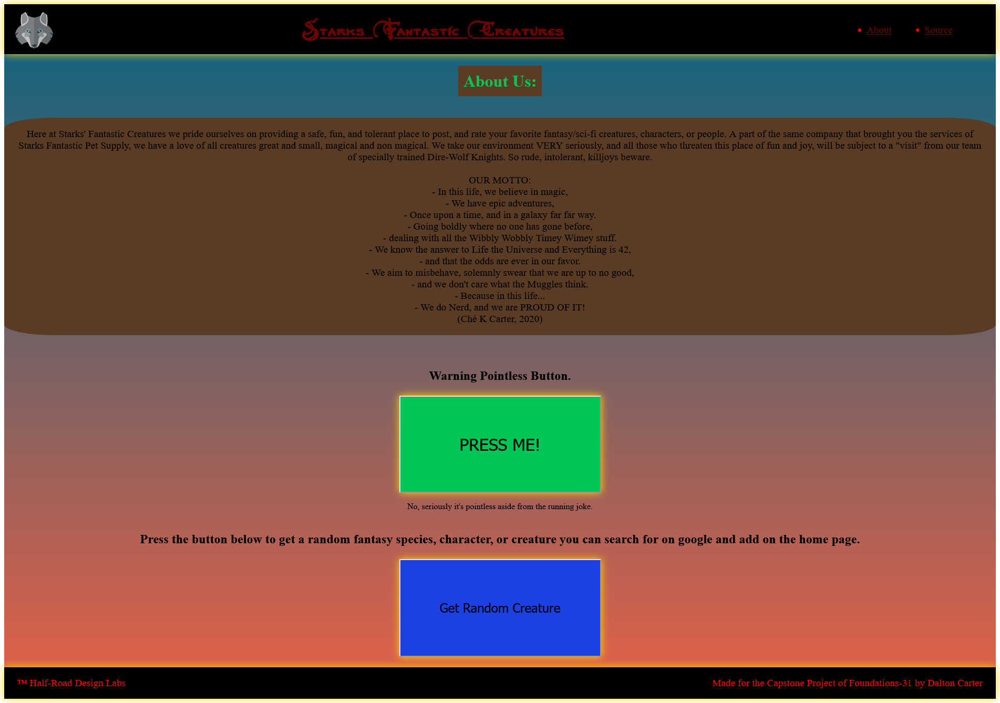

# F-31 Capstone Project: Starks' Fantastic Creatures
================================================================================================

 

 

## Warning:
>    Due to how Google Drive handles traffic with pictures there is a chance that the pictures on the Source page will fail to load with error 403. Only solution is to close, and wait for a few minutes and reload the page. Once I figure out a more permanent soulution I will fix this.

## Technology Used:
>    This project was made using: HTML 5, CSS, JavaScript, Axios, Express, And CORS.
 >       (The Source page only utilizes HTML 5, CSS, and JavaScript...for now)

## Challenges:
   > This project mercifully went relatively smoothly, no major mind shattering bugs or problems. The 2 Challenges that I did encounter were more...annnoying than problematic, and one of them does not have a satisfactory reason for why it occured. 

  1. I spent over 2 hours reading up on, and playing with CSS in order to achieve a workable reactivity. It was tedious, mildly annoying, and ultimately only produced something that was good enough to be moving on with. I will definately have to study and experiment further in order to reliably get something better than that.

  2. When I was copying the code for the Source Page, from where it was stored, I ran into a weird issue where the HTML would not run the script element I had in place. No errors were displayed either in the inspection console or locally, I had the element in the same place as the ones in the Home and About pages, I double checked syntax and it checked out, I double, triple, AND quadruple checked the file path and that also checked out. Google search turned up nothing helpful, and ultimately I wound up Copying and pasting HTML and JS files, that I knew worked, into the directory I was using for the source page, and those worked, even after they were renamed, the file paths changed to match their new directory, and the contents filled with the imported code. I have no explanation for this, but I got it working all the same.

## Overview:
   > Two of the three pages of this site were made for my Foundations capstone or final.
>The following is true for both the Home page, and the About Page, the Source page will be listed sepperately;
  * The Wolf icon will animate when hovered over.
  * When Hovered over the site name and nav bar items will also animate.
  * Clicking the Site name will return you to the home page
  * Nav Links to an About page, and a page called Source. 
  * Both pages are reactive, and will display reasonably well on smartphones, (I recommend the horizontal view.)
    + I have not tested the reactive functionality of the Source Page. It should display, but likely will not be perfect. I will fix this when time allows.

    ## Reactive Views:

Home Page:
 
Horizontal View:
 

 
Vertical View:
 

 
About Page:
 
Horizontal View:
 

 
Vertical View:
 

 
Source Page:
 
Horizontal View:
 

 
Vertical View:
 

 

### Home Page Features:
  1. An aside Element that essentially says to mind your manners and behave yourself.
  2. Three input fields; 1 for a Name, 1 for a Species, and 1 for an image URL
  3. Upon Submission of required fields, your entry will be added to the bottom of the page.
  4. Under the heading "Creatures" you will find a couple stock entries that as of now are contained in a db.json
  5. Creature entries contain a picture, the name, species, and have functionality for upvoting and down voting the individual creatures, and the option to delete an entry.

Home Page Image:
 

### About Page Features:
  1. Contains a small paragraph about the fictional company.
  2. A poem that serves as the company motto.
  3. A pointless Button that changes it's internal text each time it's pressed. Done for the laughs, and the practice setting that kind of thing up 
    + (Text changes 10 times and then it resets.)
  4. A more useful button that will pick a random entry from an array, and generate an alert with a message telling the user to google the selection and add it to the home page.
    + (11 possible selections)

About Page Image:
 

 ## About the Source page:

> This page was originally the capstone project for my Coding Basics course in June/July of 2022. It is an interactive mock-up of an e-commerce site under the same fictional "Starks' Fantastic" brand. It serves as the inspiration for the theme, and approach, to my Foundations Capstone, so I wanted to add it on for flavor, and curiosity. It has been altered a bit from the original in the following ways;

  * The Nav Bar is now fully functional, originally it was only a few placeholders that were meant to simulate a nav bar.
  * Clicking the Store Title will return you to the Starks Fantastic Creatures Home Page, originally it would perform some CSS animation.
  * The JavaScript variable declarations have been updated from 'var' to 'let' 
    + (When possible I will review the code and determine if it is possible to clean it up further.)
  * The CSS has been changed to account for it's inclusion into this project. The Header and Footer specifically.

  ### Source Page Features:
  1. Icons, store title, and Nav Bar display animations when hovered over.
  2. When adding items to your "cart" the number of items and your total "price" will increment accordingly.
  3. Clear Cart button does just that, it clears your cart count and total.
  4. The checkout button, when clicked, will change it's internal text depending on if there is 1 or more items in your "cart" or nothing at all.
  5. Roughly half of the store products have images that were customized by me in photoshop specifically for this project.
    + The images for the books, and the food items will enlarge when hovered over, so you can read the flavor text, title, and author.
  6. Clicking the add to cart button will increment your cart count, and add the "price" of the item to your total.
  7. The "Read Excerpt" and "Details" button when clicked will display a "price" and either a fun sample paragraph from the book, or a brief paragraph describing the product.
    + All of the text is unique to the item, I did not use any placeholder text for this project.
  8. There is an email submission field in the footer that when provided with a submitted input will replace the input field and submission button with a personalized "Thank you for signing up message."
  9. Div with cart and total will scroll with the screen.

About Page Image:
 

 
Second View:
 

